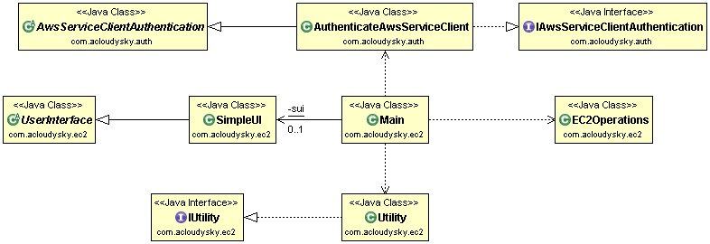

# aws-client-ec2  
Java console application which shows how to interact with Amazon EC2. 
The following figure is the application architecture (class diagram):  
 
 
For details see:

- [Best Practices for Amazon EC2](http://docs.aws.amazon.com/AWSEC2/latest/UserGuide/ec2-best-practices.html)
- [New Features for Amazon EC2: Elastic Load Balancing, Auto Scaling, and Amazon CloudWatch](https://aws.amazon.com/blogs/aws/new-aws-load-balancing-automatic-scaling-and-cloud-monitoring-services/)
- [What is the AWS SDK for Java?](http://docs.aws.amazon.com/AWSSdkDocsJava/latest/DeveloperGuide/welcome.html)

Also, see the companion blog post at this location: 
[Build AWS EC2 Client Application](http://acloudysky.com/build-aws-ec2-client-application/).

## Prerequisites
- 📝 You must have Maven installed. The dependencies are satisfied by building the Maven package. 
- 🚨 Also assure to download the [aws-client-auth](https://github.com/milexm/aws-client-auth) project and include it in this client app project. 
- 📝 If you use Eclipse to build the application (why not?) follow the steps describe at: [Include a Project](http://acloudysky.com/cloud-application-common-tasks/#include). 

📝 Make sure that the *aws-auth-client* compiled correctly.

## Security Credentials ##
🚨 You need to set up your AWS security credentials before the sample code is able to connect to AWS. You can do this by creating a file named "credentials" in the **~/.aws/** directory on Mac (C:\Users\USER_NAME.aws\ on Windows) and saving the following lines in the file:

     [default]
    	aws_access_key_id = <your access key>
    	aws_secret_access_key = <your secret key>
For information on how to obtain the above keys, refer to [aws-client-auth README](https://github.com/milexm/aws-client-auth/blob/master/README.md) file.

## Running the Example ##
The application connects to Amazon's <a href="http://aws.amazon.com/ec2" target="_blank">Amazon Elastic Computing (EC2)</a>, and allows the user to create a bucket, upload an object into the bucket, download the object, delete the object and delete the bucket. All you need to do is run it by following these steps:

1. From the project, create an executable JAR
2. From a terminal window, go to the directory containing the JAR and execute a command similar to the following: 

  		java -jar aws-ec2-java.jar us-west-2

Alternatively, you can use a tool like Eclipse to build the application and run it

Assure that the pom.xml file has the following dependency, otherwise you'll get a runtime error when executing the jar. 

<pre>
&lt;dependency&gt;
  &lt;groupId&gt;joda-time&lt;/groupId&gt;
  &lt;artifactId&gt;joda-time&lt;/artifactId&gt;
  &lt;version&gt;2.9&lt;/version&gt;
&lt;/dependency&gt;
</pre>
See <a href="http://mvnrepository.com/artifact/joda-time/joda-time/2.8.1" target="_blank">Joda Time » 2.8.1</a>. 

## License  ## 
This sample application is distributed under the [Apache License, Version 2.0](http://www.apache.org/licenses/LICENSE-2.0).

